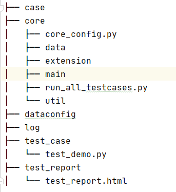
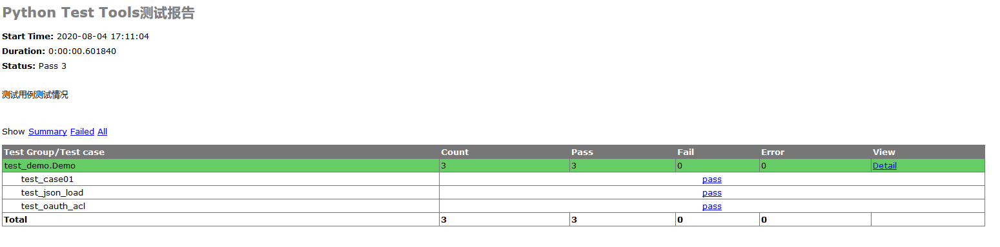

# restful-test-tools

基于python3的Restful API测试工具

## 目录结构如下

## 目录结构说明

- case：存放excel，用于定义一组测试用例；
- core：定义测试用到的路径；获取excel文件中相应数据的方法封装，获取excel中对应表格内的数据；定义工具类；生成测试报告的扩展；run_all_testcases.py运行所有的测试用例并生成测试报告；

- dataconfig：存放请求中涉及到的header、cookies等数据；

- log：存放测试完成之后生成的日志文件，可以查看日志定位问题；

- test_case：存放unittest测试用例

- test_report：存放测试报告

## 如何使用

1. 自定义case文件夹下的excel；
2. 自定义test_case下的测试用例，根据场景写单个测试用例或者组测试用例；
3. 运行run_all_testcases.py获取结果；

### 测试报告

